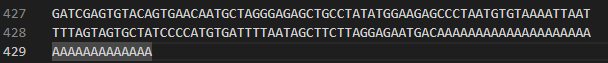

# A4-COMP4820

## How to Run

## Experiment 1

### Commands Used

`hyperfine "python de_bruijn.py --reads ./simulated-reads/covid.fasta_simulated-errors-tips-bubbles.fq --kmer-size 13" "python de_bruijn.py --reads ./simulated-reads/covid.fasta_simulated-errors-tips-bubbles.fq --kmer-size 37" "python de_bruijn.py --reads ./simulated-reads/covid.fasta_simulated-errors-tips-bubbles.fq --kmer-size 51"`

### Experiment 1 answers

a. `The value for k=13 is specifically chosen because it will introduce cycles in the graph given the genome we’re using.`

- `Find a part of the original genome’s sequence that causes this cycle and explain why it causes a cycle (hint: it’s at the end of the sequence).`
- `In your implementation: do you break the cycle during bubble popping or are you breaking the cycle somewhere else (e.g., in reconstructing the sequence)? Why did you choose to do it this way?`

Answer:

- As shown in the picture above, a cycle exists because of the repeated sequence of 'A's. Since the length of this repeated sequence is greater than k, the k-mers generated from it will produce identical nodes appearing consecutively,forming a loop where the node 'AAA...A' cycles back to itself.

- In my implementation, I handle cycles during the bubble popping process within the function traverse_find_bubble_iterative and also during the contigs creation within the function create_contigs.

  I chose this approach because handling cycles during bubble popping prevents unnecessary removal of nodes. Specifically, in my implementation, the function will detect bubble by identifying nodes that are visited more than once. Consequently, by having a cycle, my function will always return true in this case. That's the reason why I need to handle it during the bubble popping.

  However, since I do not explicitly remove edges to resolve cycles in the bubble popping step, they may still exist in the graph. In the worst-case scenario, a cycle could occur at the end of the graph. To handle this during contig generation, I ensure that nodes with an outdegree of 0 (end nodes) are checked for prior visits. This step ensures proper detection and handling of cycles, preventing potential infinite loops.

b. `How does the runtime performance of your implementation change as you adjust the value of k? Why does the runtime performance change as you adjust k? Is this what you expected? Why or why not? `

- klala

c. `How does the memory usage of your implementation change as you adjust the value of k? Why does the memory usage change as you adjust k (if at all)? Is this what you expected? Why or why not? `

d.`How is the output (contigs) from your implementation affected by the change in k? Is this what you expected? Why or why not?`
