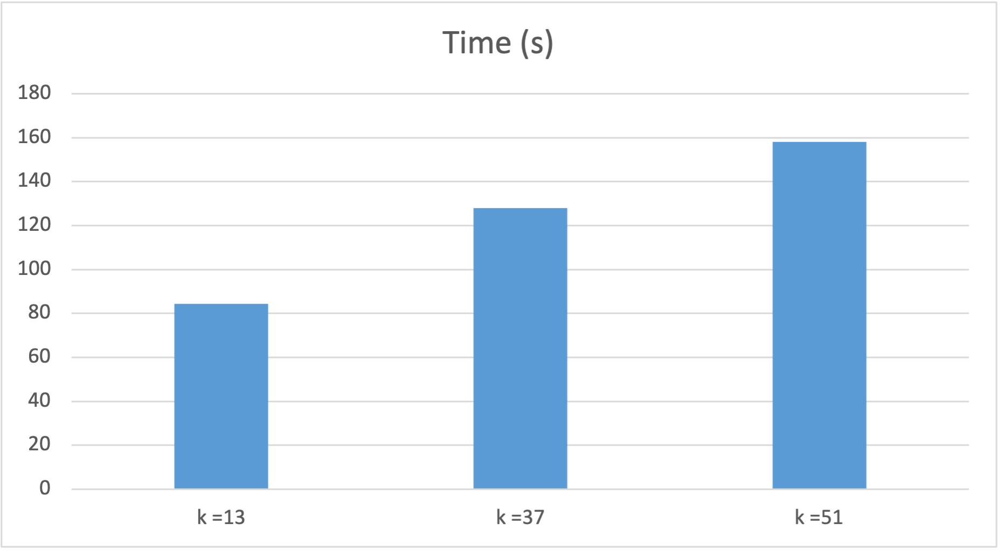

# A4-COMP4820

## How to Run

NOTE: One run could take about 1-5 minutes. So, please wait for the program to be finished.

Command-line arguments:

- The filename of the read set (a file in FASTQ format) (--reads; required, no default value).
  The
- k-mer size (--kmer-size; optional, default value 37).

Example:

`python de_bruijn.py --reads ./simulated-reads/covid.fasta_simulated-errors-tips-bubbles.fq --kmer-size 51`

## Experiment 1

### Commands Used

`hyperfine "python de_bruijn.py --reads ./simulated-reads/covid.fasta_simulated-errors-tips-bubbles.fq --kmer-size 13" "python de_bruijn.py --reads ./simulated-reads/covid.fasta_simulated-errors-tips-bubbles.fq --kmer-size 37" "python de_bruijn.py --reads ./simulated-reads/covid.fasta_simulated-errors-tips-bubbles.fq --kmer-size 51"`

### Sample Output For Each Command

#### kmer = 13

#### kmer = 37

#### kmer = 51

### Experiment 1 answers

a. `The value for k=13 is specifically chosen because it will introduce cycles in the graph given the genome we’re using.`

- `Find a part of the original genome’s sequence that causes this cycle and explain why it causes a cycle (hint: it’s at the end of the sequence).`
- `In your implementation: do you break the cycle during bubble popping or are you breaking the cycle somewhere else (e.g., in reconstructing the sequence)? Why did you choose to do it this way?`

- As shown in the picture above, a cycle exists because of the repeated sequence of 'A's. Since the length of this repeated sequence is greater than k, the k-mers generated from it will produce identical nodes appearing consecutively,forming a loop where the node 'AAA...A' cycles back to itself.

- In my implementation, I handle cycles during the bubble popping process within the function traverse_find_bubble_iterative and also during the contigs creation within the function create_contigs.

  I chose this approach because handling cycles during bubble popping prevents unnecessary removal of nodes. Specifically, in my implementation, the function will detect bubble by identifying nodes that are visited more than once. Consequently, by having a cycle, my function will always return true in this case. That's the reason why I need to handle it during the bubble popping.

  However, since I do not explicitly remove edges to resolve cycles in the bubble popping step, they may still exist in the graph. In the worst-case scenario, a cycle could occur at the end of the graph. To handle this during contig generation, I ensure that nodes with an outdegree of 0 (end nodes) are checked for prior visits. This step ensures proper detection and handling of cycles, preventing potential infinite loops.

b. `How does the runtime performance of your implementation change as you adjust the value of k? Why does the runtime performance change as you adjust k? Is this what you expected? Why or why not? `

- Based on the graph above, we can see that the highest runtime occurs when k = 51, and the lowest is when k = 13. The runtime performance change as we adjust k, because the structure of the graph depends directly on the k-mers generated,which in turn depend on the k-size. Furthermore, as we change the k size, it is also important to note that the structure of the errors (bubbles and tips) also changes with k which impacts the runtime. Yes, this is what I expected.

  As k increases, each node in the graph represents a longer sequence. During graph creation, the program spends more time checking if each pair of nodes already exists in the graph. Since larger k-sizes result in longer sequences, the time required for these operations increases, contributing to longer runtimes.

  Furthermore, k also influences the behaviour of errors in the graph, such as bubbles and tips. So, with the larget k-size this means there could potentialy be more unique nodes in the graph, which could result in a longer chain of tips and bubbles. Thus, longer tips to be pruned and bubbles to be popped, which will increase the runtime performance.

c. `How does the memory usage of your implementation change as you adjust the value of k? Why does the memory usage change as you adjust k (if at all)? Is this what you expected? Why or why not? `

- Based on the graph above, we can see that the highest memory usage occurs when k = 51, and the lowest occurs when k = 13. The memory usage changes as we adjust k, for the same reasons mentioned in part b. The k-size directly affects the structure of the graph and also the structure of errors. Yes, this is what I expected.

  Why? Because as we increase the size of k, this means that a node will have a longer sequence, resulting in a larger hash value that needs to be stored in the dictionary (since I used a dictionary for the graph storage). This requires storing bigger sequences in memory, thus leading to larger memory usage.

  Furthermore, in terms of errors, as stated previously, a larger k-size could result in a longer chain of tips and bubbles. Thus, more nodes and edges with long sequences need to be stored in the graph, resulting in increased memory usage.

d.`How is the output (contigs) from your implementation affected by the change in k? Is this what you expected? Why or why not?`

NOTE: in create_contigs, I explained that after error removals, if the graph still has a node that has outdegree > 1, I arbitrarily choose the path with the highest weight for creating the contigs.

- Based on the graph above, we can see that as k increases, the number of contigs generated decreases. I believe that the change in k affects the contig output because of how nodes, edges, and errors are created in the graph, therfore changing the structure of the graph. Yes, this is what I expected.

  Why? From what I expect, I believe that a graph with a lower k-size will potentially have more tips and bubbles scattered across the graph. Shorter k-mers are more likely to result in the assembler generating different nodes and edges, leading to the creation of smaller contigs across the graph.

  On the other hand, a larger k-size represents longer sequences. It is less likely for the graph to generate more nodes and edges since there are fewer possible k-mers that are used to make the nodes. Thus, the assembler is less likely to generate small and scattered contigs.
